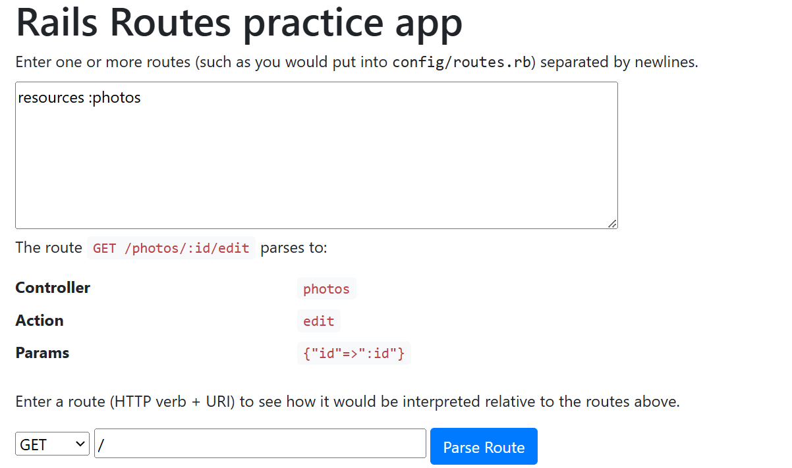

Rails Routing Practice
======================

This simple app lets students learning Rails get some practice
understanding how routes from `config/routes.rb` are parsed.

The learner enters some `config/routes.rb`-compliant route descriptions,
and can then enter various routes (method + URI) to see how they would
be recognized and how `params` would be parsed from them.

# ศึกษาการสร้าง Routing ของ Rails!
## resources:photos!
## เพื่อสร้าง 

## สามารถศึกษาการทำได้โดยใช้เว็บ https://rails-routing-practice.saasbook.info/

Everything here is [CC-BY-NC-SA](https://creativecommons.org/licenses/by-nc-sa/4.0/legalcode).

